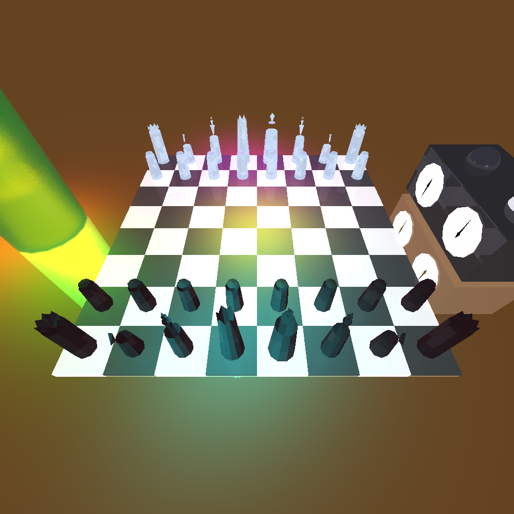

# Advanced Ray Tracing Engine in Java

## 🌟 Project Overview

This is a sophisticated **3D ray tracing engine** implemented in Java, designed for high-performance photorealistic rendering. The project demonstrates advanced computer graphics techniques including geometric intersection algorithms, acceleration structures, multi-threading, and physically-based lighting models. It features a comprehensive set of 3D primitives, advanced visual effects, and cutting-edge optimization techniques.



**Key Features:**

- 🎯 **High-Performance Ray Tracing**: Optimized ray-geometry intersection algorithms
- ⚡ **Regular Grid Acceleration**: 3D spatial partitioning with DDA traversal for performance
- 🧵 **Multi-Threading Support**: Parallel processing for faster rendering
- 🔮 **Advanced Visual Effects**: Diffusive glass, soft shadows, reflections, and refractions
- 🏗️ **Robust Architecture**: Built following SOLID principles and design patterns
- 📐 **Rich Geometry Library**: Comprehensive set of 3D primitives with full intersection support
- 📄 **XML Scene Import**: Flexible scene configuration through XML files

---

## 📚 Table of Contents

1. [🎯 Quick Start](#-quick-start)
2. [📐 Supported Geometries](#-supported-geometries)
3. [🏗️ Software Architecture](#️-software-architecture)
4. [🎨 Design Patterns](#-design-patterns)
5. [✨ Bonus Features](#-bonus-features)
   - [🔮 Diffusive Glass Implementation](#-diffusive-glass-implementation)
   - [⚡ Regular Grid Acceleration](#-regular-grid-acceleration)
   - [🧵 Multi-Threading](#-multi-threading)
6. [📄 XML Scene Import](#-xml-scene-import)
7. [🤖 GitHub Actions](#-github-actions)
8. [🖼️ Gallery](#️-gallery)
9. [🛠️ Building the Project](#️-building-the-project)
10. [📝 License](#-license)

---

## 🎯 Quick Start

```bash
# Clone the repository
git clone <repository-url>
cd ISE5785_6688_1854

# Build the project
mvn compile

# Run tests
mvn test

# Generate images (example)
mvn exec:java -Dexec.mainClass="YourMainClass"
```

---

## 📐 Supported Geometries

Our ray tracing engine supports a comprehensive collection of 3D geometries with fully implemented intersection algorithms:

### ✅ Fully Implemented Geometries

These geometries have complete `findIntersections` method implementations and can be used for rendering:

| Geometry     | Description                   | Intersection Status | Use Cases                      |
| ------------ | ----------------------------- | ------------------- | ------------------------------ |
| **Sphere**   | Perfect 3D sphere primitive   | ✅ Implemented      | Balls, planets, bubbles        |
| **Plane**    | Infinite 2D plane in 3D space | ✅ Implemented      | Floors, walls, mirrors         |
| **Triangle** | 3-vertex triangular surface   | ✅ Implemented      | Mesh rendering, complex models |
| **Polygon**  | Multi-vertex planar surface   | ✅ Implemented      | Complex flat surfaces          |
| **Cylinder** | Finite cylindrical surface    | ✅ Implemented      | Pipes, columns, containers     |

### 🚧 Partially Implemented Geometries

These geometries have method stubs but require implementation:

| Geometry | Description                  | Status       |
| -------- | ---------------------------- | ------------ |
| **Tube** | Infinite cylindrical surface | 🚧 Stub only |

### 🔧 Core Geometry Features

- **Bounding Box Calculations**: Automatic AABB generation for acceleration
- **Normal Vector Computation**: Precise surface normal calculation
- **Material Properties**: Support for emission, reflection, refraction, and shininess
- **Transformation Support**: Translation, rotation, and scaling capabilities

---

## 🏗️ Software Architecture

This project follows **Test-Driven Development (TDD)** and adheres to key software engineering principles:

### SOLID Principles Implementation

- **Single Responsibility**: Each class has one clear purpose
- **Open/Closed**: Extensible design for new geometries and effects
- **Liskov Substitution**: Proper inheritance hierarchies
- **Interface Segregation**: Focused interfaces like `Intersectable`
- **Dependency Inversion**: Abstract dependencies, concrete implementations

### Package Structure

```
├── 📦 acceleration/     # Grid acceleration and spatial optimization
├── 📦 geometries/       # 3D primitive shapes and intersections
├── 📦 lighting/         # Light sources and illumination models
├── 📦 primitives/       # Core mathematical primitives (Point, Vector, Ray)
├── 📦 renderer/         # Ray tracing engine and camera system
├── 📦 sampling/         # Super-sampling and effect generation
├── 📦 scene/           # Scene management and object collections
└── 📦 test/            # Comprehensive unit test suite
```

---

## 🎨 Design Patterns

Our implementation showcases several well-crafted design patterns:

### 🏭 Factory Pattern

- **SamplerFactory**: Creates appropriate samplers for different rendering effects
- **Camera.Builder**: Builder pattern for flexible camera configuration

### 🎯 Strategy Pattern

- **TargetAreaBase**: Pluggable sampling strategies (Grid, Jittered, Random)
- **RayTracer**: Multiple ray tracing implementations (Simple, Extended, Grid-accelerated)

### 🔍 Template Method

- **Intersectable**: Abstract base with template method for intersection calculations
- **Geometry**: Common structure for all geometric primitives

### 🧵 Thread-Local Pattern

- **VoxelTraverser**: Thread-safe grid traversal for multi-threading
- **PixelManager**: Coordinated pixel processing across threads

---

## ✨ Bonus Features

### 🔮 Diffusive Glass Implementation

Our **first bonus feature** implements sophisticated diffusive glass effects that simulate realistic light scattering through rough glass surfaces.

#### 🏗️ Architecture

The implementation follows excellent software craftsmanship principles:

```java
// Extensible sampling system
public abstract class TargetAreaBase {
    protected abstract List<Point> getSamplePoints(Intersection intersection);
    public abstract List<Ray> generateRays(Intersection intersection);
}

// Specialized diffusive glass implementation
public class DiffusiveTargetArea extends TargetAreaBase {
    // Multiple sampling patterns: Grid, Jittered, Random
    // Configurable shapes: Circle, Square
    // Material-aware roughness scaling
}
```

#### ⚙️ How It Works

1. **Ray Refraction**: Calculates perfect transmission using Snell's law
2. **Roughness Sampling**: Generates scattered rays based on material roughness
3. **Pattern Generation**: Supports multiple sampling patterns (Grid, Jittered, Random)
4. **Shape Control**: Circular or square sampling areas
5. **Performance Optimization**: Configurable sample counts

#### 🔧 Easy Extension

The well-designed architecture makes it trivial to add new super-sampling effects:

```java
// Adding new effects is as simple as:
SamplerFactory.createSampler(EffectType.SOFT_SHADOW, config);
SamplerFactory.createSampler(EffectType.DEPTH_OF_FIELD, config);
```

---

### ⚡ Regular Grid Acceleration

Our **second bonus feature** implements a high-performance **Regular Grid** acceleration structure using advanced 3D-DDA traversal.

#### 🏗️ Software Craftsmanship

The implementation demonstrates excellent software design:

```java
// Separation of concerns
public class RegularGrid {
    // Responsible ONLY for grid construction and voxel lookup
    // Clean world ↔ grid coordinate conversion
    // Efficient geometry distribution
}

public class VoxelTraverser {
    // Responsible ONLY for ray traversal algorithms
    // 3D-DDA implementation with bug fixes
    // Thread-safe geometry testing
}
```

#### ⚙️ Advanced Features

- **Automatic Resolution**: Calculates optimal grid resolution based on scene complexity
- **Infinite Geometry Handling**: Separates infinite objects (planes) from finite ones
- **3D-DDA Traversal**: Digital Differential Analyzer for efficient voxel stepping
- **Deduplication**: Prevents testing the same geometry multiple times
- **Bounding Box Integration**: Uses AABB for precise geometry distribution

#### 📈 Performance Benefits

The Regular Grid provides significant performance improvements:

- **Spatial Partitioning**: O(1) average voxel lookup
- **Early Ray Termination**: Stops traversal when no intersections possible
- **Reduced Intersection Tests**: Only test geometries in relevant voxels

---

### 🧵 Multi-Threading

Enhanced with **thread-safe multi-threading** for even faster rendering performance:

#### 🔧 Threading Modes

```java
// Flexible threading configuration
.setMultithreading(0)   // Single-threaded
.setMultithreading(-1)  // Stream parallelization
.setMultithreading(-2)  // Optimal core count
.setMultithreading(4)   // Specific thread count
```

#### 🛡️ Thread Safety

- **Thread-Local Storage**: Each thread has its own VoxelTraverser
- **Atomic Operations**: Thread-safe pixel allocation
- **Synchronized Access**: Protected shared data structures

---

## 📄 XML Scene Import

The **XML Scene Import** feature provides a flexible and powerful way to define complex 3D scenes through declarative XML configuration files. This allows for easy scene composition, modification, and sharing without recompiling the code.

### 🏗️ Architecture

The XML parsing system is built with clean separation of concerns:

```java
// Core XML parsing utilities
public class XMLParser {
    // Scene configuration
    public static Scene BuildSceneFromXML(String xmlFileName);

    // Camera setup
    public static Camera BuildCameraFromXML(String xmlFileName);

    // Utility parsers for primitives
    public static Double3 parseDouble3(Element parent);
    public static Color parseToColor(Element parent);
    public static Material parseToMaterial(Element parent);
}
```

### 📝 XML Structure

The XML format supports comprehensive scene definition:

#### 🎬 Camera Configuration

```xml
<Camera>
    <Position>
        <x>0</x> <y>0</y> <z>5</z>
    </Position>
    <Directions>
        <Direction1>
            <vTo><x>0</x><y>0</y><z>-1</z></vTo>
            <vUp><x>0</x><y>1</y><z>0</z></vUp>
        </Direction1>
    </Directions>
    <Size>
        <Width>800</Width>
        <Height>600</Height>
    </Size>
    <Distance>3</Distance>
    <Resolution>
        <nX>800</nX>
        <nY>600</nY>
    </Resolution>
</Camera>
```

#### 🎭 Scene Definition

```xml
<Scene>
    <Name>MyScene</Name>
    <BackgroundColor>
        <r>0.1</r> <g>0.1</g> <b>0.3</b>
    </BackgroundColor>
    <AmbientLight>
        <r>0.2</r> <g>0.2</g> <b>0.2</b>
    </AmbientLight>
    <Geometries>
        <Sphere>
            <Center><x>0</x><y>0</y><z>0</z></Center>
            <Radius>1.0</Radius>
            <Material>
                <Ambient><x>0.2</x><y>0.2</y><z>0.2</z></Ambient>
                <Diffuse><x>0.8</x><y>0.3</y><z>0.3</z></Diffuse>
                <Specular><x>1.0</x><y>1.0</y><z>1.0</z></Specular>
                <Shininess>50</Shininess>
            </Material>
            <Emission><r>0</r><g>0</g><b>0</b></Emission>
        </Sphere>
    </Geometries>
    <ExternalLights>
        <PointLight>
            <r>1.0</r> <g>1.0</g> <b>1.0</b>
            <Position><x>2</x><y>2</y><z>2</z></Position>
            <Attenuation>
                <Constant>1.0</Constant>
                <Linear>0.1</Linear>
                <Quadratic>0.01</Quadratic>
            </Attenuation>
        </PointLight>
    </ExternalLights>
</Scene>
```

### ✨ Key Features

- **📐 Complete Geometry Support**: Spheres, Triangles, Planes, and Polygons
- **💡 All Light Types**: Directional, Point, and Spot lights with full attenuation
- **🎨 Rich Material Properties**: Ambient, Diffuse, Specular, and Emission components
- **📷 Flexible Camera Setup**: Multiple direction modes and full viewport control
- **🎯 Robust Parsing**: Comprehensive error handling and validation
- **🔧 Easy Extension**: Clean architecture for adding new geometry types

### 🚀 Usage Example

```java
// Load a complete scene from XML
Scene scene = XMLParser.BuildSceneFromXML("scenes/myScene.xml");
Camera camera = XMLParser.BuildCameraFromXML("cameras/mainCamera.xml");

// Render the scene
camera.renderImage();
camera.writeToImage();
```

---

## 🤖 GitHub Actions

Our project includes comprehensive **GitHub Actions** workflows for continuous integration:

### 🔄 Automated Testing

**Trigger Events:**

- Push to `main` branch
- Pull requests to `main` branch

**Test Matrix:**

- **Primitives Tests**: `PointTests`, `RayTests`, `VectorTests`
- **Geometry Tests**: `SphereTests`, `PlaneTests`, `TriangleTests`, `PolygonTests`, `CylinderTests`, `TubeTests`, `GeometriesTests`

### ⚙️ Workflow Features

- **Java 21 Support**: Modern JDK with Temurin distribution
- **Maven Caching**: Faster build times
- **Parallel Testing**: Matrix strategy for efficient test execution
- **Detailed Reports**: JUnit XML reports with detailed summaries
- **Failure Tolerance**: Continue on test failures for complete coverage
- **Progress Tracking**: Real-time test result summaries

### 📊 Test Reporting

Each test run generates:

- Detailed test reports with pass/fail status
- Stack traces for debugging failures
- Performance metrics
- Coverage summaries

---

## 🖼️ Gallery

Here are some stunning images generated by our ray tracing engine:

### 🏆 Chess Board Scene with Advanced Features

**ChessBoard With Grid With MT - Easy.png**


_Complex scene featuring chess pieces, trophy display case with diffusive glass, advanced lighting, and Regular Grid acceleration with multi-threading._

---

## 🛠️ Building the Project

### Prerequisites

- **Java 21** or higher
- **Apache Maven 3.6+**
- **Git**

### Build Commands

```bash
# Compile source code
mvn compile

# Run all tests
mvn test

# Run specific test class
mvn test -Dtest=SphereTests

# Run tests with detailed output
mvn test -DtrimStackTrace=false

# Package the project
mvn package

# Clean build artifacts
mvn clean
```

### Project Structure

```
ISE5785_6688_1854/
├── src/                    # Source code
├── unittests/             # Unit tests
├── images/                # Generated images
├── .github/workflows/     # CI/CD configuration
├── pom.xml               # Maven configuration
└── README.md             # This file
```

### IDE Setup

- **IntelliJ IDEA**: Import as Maven project
- **Eclipse**: Import existing Maven project
- **VS Code**: Install Java Extension Pack

---

## 📝 License

This project is developed as part of the **ISE5785** course curriculum. It serves as an educational implementation of advanced computer graphics and ray tracing techniques.

### Usage Rights

- ✅ Educational use and learning
- ✅ Academic reference and study
- ✅ Non-commercial research

### Restrictions

- ❌ Commercial distribution
- ❌ Plagiarism or academic dishonesty
- ❌ Redistribution without attribution

---

## 🤝 Contributing

While this is primarily an academic project, we welcome:

- 🐛 Bug reports and issues
- 💡 Feature suggestions
- 📚 Documentation improvements
- 🧪 Additional test cases

---

## 🎓 Academic Excellence

This project demonstrates mastery of:

- **Advanced Object-Oriented Programming**
- **Computer Graphics Algorithms**
- **Performance Optimization Techniques**
- **Software Engineering Best Practices**
- **Test-Driven Development**
- **Parallel Computing**

---

_Built with ❤️ using Java, Maven, and lots of mathematical precision_ ✨
